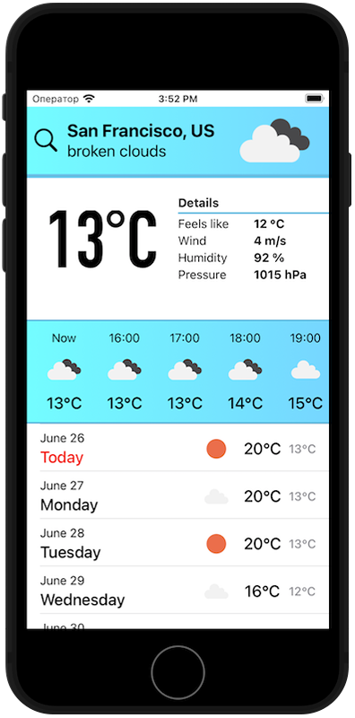
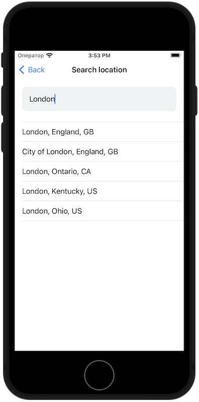

###  __MyWeather__
This is a simple weather application with the ability to determine your geolocation or with manual selection of geolocation.
###### Application stack:
* SwiftUI
* Combine
* CoreLocation
* [OpenWeatherMap API](https://openweathermap.org/api)
***
###  __Preview__

***
###  __Feedback__
Telegram - @Sa1monch
Email - sadyrevdimon@icloud.com
